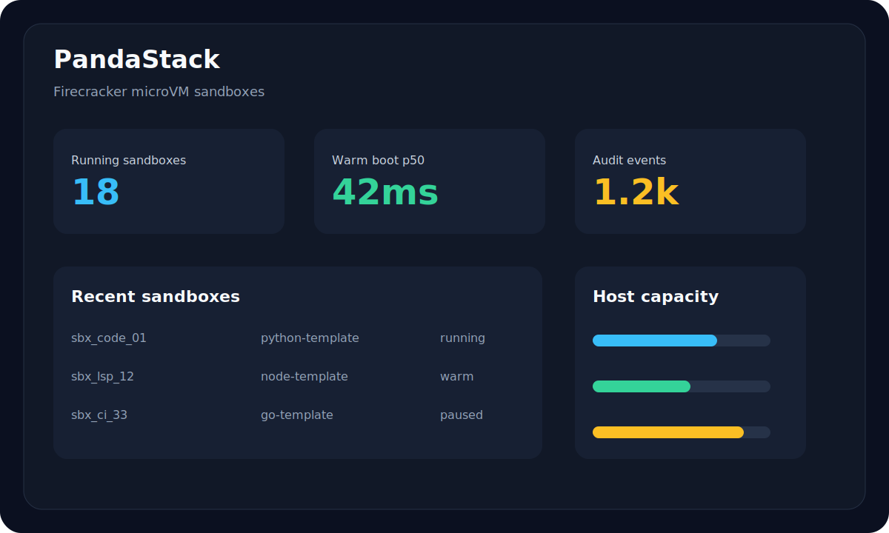

<p align="center">
  
</p>

# PandaStack

Open-source Firecracker microVM sandboxes for AI agents and code execution.

[](LICENSE)
[](https://github.com/pandastack-io/pandastack-ai/actions/workflows/ci.yml)
[](https://github.com/pandastack-io/pandastack-ai/stargazers)



> _The image above is an illustration of the dashboard, not a product screenshot._

## 60-second quickstart

```bash
git clone https://github.com/pandastack-io/pandastack-ai
cd pandastack-ai
bash scripts/mac-local-e2e.sh
open http://localhost:3000
```

Create a sandbox from the local API:

```bash
curl -sS http://localhost:8080/v1/sandboxes \
  -H 'Authorization: Bearer pds_local_dev_token' \
  -H 'Content-Type: application/json' \
  -d '{"template":"base"}'
```

Exec a command in it:

```bash
curl -sS http://localhost:8080/v1/sandboxes/<id>/exec \
  -H 'Authorization: Bearer pds_local_dev_token' \
  -H 'Content-Type: application/json' \
  -d '{"cmd":"echo","args":["hello"]}'
```

## What it does

- Firecracker microVM sandboxes with strong process and kernel isolation.
- **Git-driven app hosting** — connect a GitHub repo and PandaStack builds and deploys it on the universal `base` runtime (Node/Python/Go/Bun via [mise](https://mise.jdx.dev)), with blue-green cutover and a stable preview URL. Vercel/Render/Railway-style deploys on your own microVMs.
- **Managed PostgreSQL 16 databases (Beta)** — a real, durable database in its own microVM, with a native `postgres://` URL in seconds.
- **Serverless functions + cron schedules** — deploy code bundles and invoke them over HTTP or on a schedule.
- Snapshot anywhere and fork running environments instantly.
- Sub-second boot on every create via baked snapshot restore — no warm pool of idle VMs.
- **On-demand UFFD memory streaming** — restore microVMs by paging guest memory lazily from object storage (GCS Range GETs) instead of downloading the full snapshot up front.
- Per-sandbox CPU, RAM, and disk quotas.
- Network egress controls for safer code execution.
- Template-based images: Docker images converted to ext4 roots.
- Pause, hibernate, and wake lifecycle controls.
- Exec, REPL, and browser terminal surfaces.
- Audit log and observability backed by Postgres and ClickHouse.
- Multi-region scheduling primitives for larger fleets.

## Use it from your code

PandaStack exposes a token-authenticated REST API. Point any HTTP client at your
self-hosted control plane (`http://localhost:8080` for local dev) and authenticate
with an API token (`pds_…`):

```bash
export PANDASTACK_API=http://localhost:8080
export PANDASTACK_API_KEY=pds_local_dev_token

# create
SBX=$(curl -sS "$PANDASTACK_API/v1/sandboxes" \
  -H "Authorization: Bearer $PANDASTACK_API_KEY" \
  -H 'Content-Type: application/json' \
  -d '{"template":"base"}' | jq -r .id)

# exec
curl -sS "$PANDASTACK_API/v1/sandboxes/$SBX/exec" \
  -H "Authorization: Bearer $PANDASTACK_API_KEY" \
  -H 'Content-Type: application/json' \
  -d '{"cmd":"uname","args":["-a"]}'

# delete
curl -sS -X DELETE "$PANDASTACK_API/v1/sandboxes/$SBX" \
  -H "Authorization: Bearer $PANDASTACK_API_KEY"
```

See the [REST API reference](docs-site/content/docs/reference/rest-api.mdx) for the full surface.

## Managed databases (Beta)

Provision a managed **PostgreSQL 16** instance running in its own dedicated Firecracker
microVM — not a shared schema on a multi-tenant cluster. Each database gets its own kernel,
`postgres` process, connection pooler, and a durable data volume. Databases are persistent:
the idle reaper never deletes them, and only an explicit `DELETE` destroys the data.

> **Beta.** Create / list / get / delete are stable. Branching, point-in-time restore, and
> read replicas are [coming soon](docs-site/content/docs/concepts/databases.mdx#coming-soon).
> Don't yet rely on a single beta database as the only copy of irreplaceable data.

```bash
# create (blocks until Postgres accepts connections, ~30–90s)
curl -X POST "$PANDASTACK_API/v1/databases" \
  -H "Authorization: Bearer $PANDASTACK_API_KEY" \
  -H "Content-Type: application/json" \
  -d '{"label":"my-app-db"}'

# connect with any PostgreSQL client (TLS required)
psql "$CONNECTION_URL?sslmode=require"
```

Manage them with `list` / `get` / `delete` (REST: `GET|DELETE /v1/databases[/{id}]`). Full
guide: [Databases docs](docs-site/content/docs/concepts/databases.mdx).

## Architecture

PandaStack separates the control plane from per-host agents. The API accepts sandbox requests, the scheduler selects capacity, and agents create or resume Firecracker microVMs. Every create restores a baked per-template snapshot (with optional UFFD memory streaming from object storage), and a snapshot store persists VM state.

```text
+--------+      +-----+      +-----------+      +------------------+      +----------------------+
| Client | ---> | API | ---> | Scheduler | ---> | Agents per host  | ---> | Firecracker microVMs |
+--------+      +-----+      +-----------+      +------------------+      +----------------------+
                     |              |                    |
                     v              v                    v
               Postgres/audit   Capacity scoring   Snapshot seeds + UFFD streaming
```

## Repository layout

| Path | What it is |
| --- | --- |
| [`api/`](api) | Control-plane REST API (Go) — sandboxes, databases, apps, functions, GitHub integration, auth. |
| [`agent/`](agent) | Per-host agent (Go) that boots and manages Firecracker microVMs. |
| [`db-proxy/`](db-proxy) | SNI-routing proxy that maps `<id>.db.<your-domain>` to the right database VM. |
| [`dashboard/`](dashboard) | Web dashboard (Next.js) — sandboxes, databases, apps, templates. |
| [`docs-site/`](docs-site) | Documentation site (Next.js + fumadocs). |
| [`templates/`](templates) | microVM template Dockerfiles — `base` (Ubuntu 24.04 + mise; Node/Python/Go/Bun app runtime), `code-interpreter`, `agent`, `browser`, `postgres-16`. |
| [`cloud-init/`](cloud-init) | Host/guest provisioning scripts. |
| [`infra/`](infra), [`deploy/`](deploy), [`ansible/`](ansible) | Infrastructure and deployment. |
| [`cookbook/`](cookbook), [`examples/`](examples) | Tutorial recipes and example projects. |

## Self-host

| Mode | Path | Docs |
| --- | --- | --- |
| Local dev (Mac, Apple Silicon) | `bash scripts/mac-local-e2e.sh` | [Apple Silicon guide](docs-site/content/docs/getting-started/local-mac-apple-silicon.mdx) |
| Local dev (Linux KVM host) | `bash scripts/linux-local-e2e.sh` | [Self-host guide](docs-site/content/docs/getting-started/self-host.mdx) |
| Multi-node (AWS) | `infra/terraform/envs/dev-aws` | [`infra/README.md`](infra/README.md) |
| Multi-node (GCP) | `infra/terraform/envs/dev-gcp-multi` | [`deploy/DEPLOY.md`](deploy/DEPLOY.md) |

## Roadmap

- [x] Local Apple Silicon developer path with Lima and Firecracker smoke test.
- [x] Managed PostgreSQL 16 databases (Beta) — durable, per-DB microVM, native `postgres://`.
- [x] Git-driven app hosting — GitHub repo → build/deploy on the `base` runtime with blue-green cutover and stable preview URLs.
- [x] On-demand UFFD memory streaming — lazily page guest memory from object storage on restore.
- [ ] Database branching, point-in-time restore, read replicas, and storage autoscaling.
- [ ] Single-node Linux self-host quickstart.
- [ ] Snapshot store adapters for additional object storage backends.
- [ ] Multi-node scheduler examples for Kubernetes, Nomad, and managed instance groups.
- [ ] 1.0 API stability and steering committee formation.

## Limitations & scope

This is the **open-source core** of PandaStack. A few things to know before you build on it:

- **Hosts must run on bare-metal KVM.** Firecracker needs `/dev/kvm`, so agents run on Linux KVM hosts or `*.metal` cloud instances. On Apple Silicon, local dev runs Firecracker inside a Lima VM via Apple Virtualization.framework (nested virt). There is no Windows/macOS-native host path.
- **No billing or metering.** This cut ships **unmetered and uncapped** — no Stripe, no subscription tiers, no per-workspace sandbox/CPU/quota limits. Self-hosters run without usage limits; if you need billing, that's a layer you add yourself.
- **No SDKs in this repo.** The Python/TypeScript SDKs and CLI are published separately (`pip install pandastack` / `npm install @pandastack/sdk`). Here you interact with the platform over the REST API directly.
- **Auth is bring-your-own.** Ships with a `stub` mode (local dev) and JWT verification (e.g. Supabase). There's no built-in user database or signup flow — wire it to your own identity provider.
- **Single-tenant-ish by default.** Org/tenancy tables exist, but the access-control model is intentionally minimal. Review it before exposing the API to untrusted users.
- **Managed databases & app-hosting are Beta.** They work, but lack branching, point-in-time restore, and read replicas. Don't make a single Beta database the only copy of irreplaceable data.
- **Object-storage coupling.** Snapshot seeds and UFFD memory streaming currently assume GCS (or an S3-compatible store). Other backends need an adapter (see Roadmap).
- **Deployment is Terraform-first.** Production deploys use the multi-node Terraform envs ([`infra/terraform/envs/dev-aws`](infra/terraform/envs/dev-aws), [`dev-gcp-multi`](infra/terraform/envs/dev-gcp-multi)). The cloud-init/user-data bootstrap scripts are functional scaffolds — review them before a real apply, and expect to adapt AMI/image baking to your environment.
- **The dashboard screenshot is an illustration**, not a product screenshot (see note above).

## Contributing

Read [CONTRIBUTING.md](CONTRIBUTING.md), [CODE_OF_CONDUCT.md](CODE_OF_CONDUCT.md), and [GOVERNANCE.md](GOVERNANCE.md) before opening a substantial PR.

## License

PandaStack is licensed under the [Apache License 2.0](LICENSE).

## Credits

PandaStack stands on excellent open-source systems and tools, including Firecracker, Lima, ClickHouse, Next.js, Postgres, Go, TypeScript, Python, Terraform, and the broader Linux virtualization ecosystem. Thank you to the maintainers and communities behind them.
